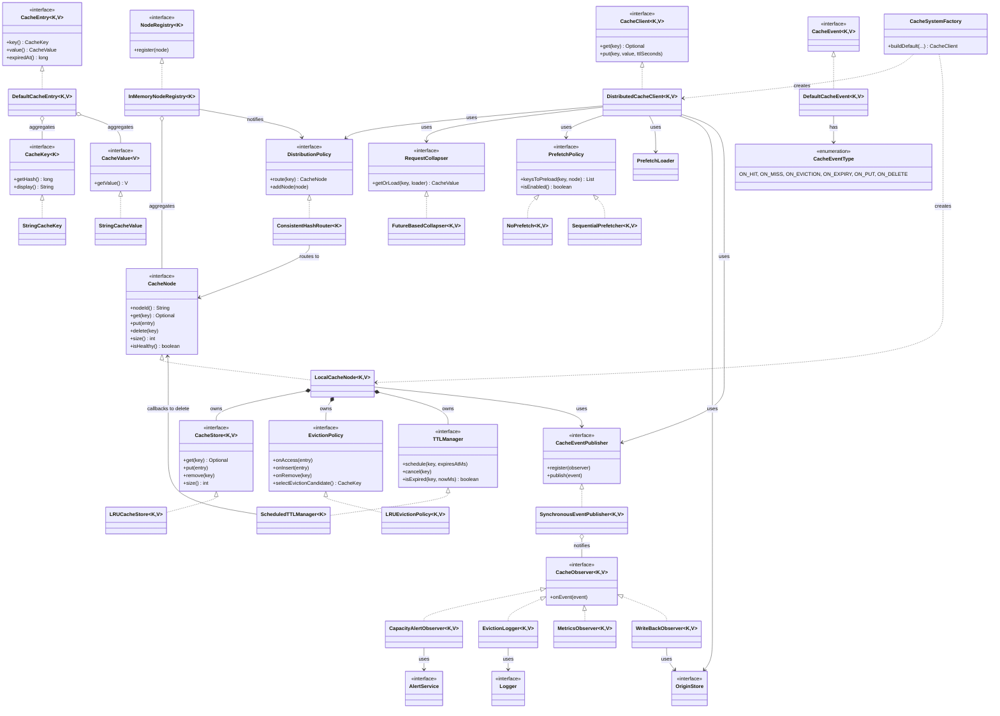

# Distributed Cache — Low Level Design

A horizontally scalable, highly extensible, and event-driven distributed cache system implemented in Java.

This project is built strictly following **SOLID principles**, ensuring that every core behavior—such as data routing, capacity eviction, TTL expiration, and cache stampede prevention—is completely decoupled and pluggable via interfaces.

## 🚀 Key Features
* **Consistent Hashing (Routing):** Minimizes key remapping during cluster scale-out/scale-in.
* **Pluggable Eviction Policies:** Currently implements $O(1)$ LRU (Least Recently Used) but is open to LFU or others.
* **Decoupled TTL Management:** Exact event-driven expiration scheduling using background executor threads combined with lazy-evaluation.
* **Request Collapsing:** Prevents "Cache Stampedes" by collapsing concurrent database fetch requests for the same missing key into a single query.
* **Event-Driven Observers:** Core cache operations publish events (`ON_HIT`, `ON_EVICTION`, etc.) asynchronously to registered observers for metrics, logging, and database write-backs.
* **Prefetching Engine:** Anticipates sequential reads to load data before the application requests it.

---

## 🏗️ System Architecture & Class Diagram

The following UML Class Diagram visualizes the core components and their structural relationships.

### UML Legend:
* `<|..` **Realization (Inheritance):** A class implements an interface.
* `*--` **Composition:** A strong lifecycle dependency (e.g., a CacheNode owns its specific CacheStore).
* `o--` **Aggregation:** A weak lifecycle dependency (e.g., a Publisher holds a list of Observers, but doesn't own them).
* `-->` **Directed Association:** A class knows about and uses another class/interface.

---

## 🧩 Architectural Walkthrough

### 1. Application Layer (`DistributedCacheClient`)
The primary entry point. The client never stores data itself. Instead, it acts as an orchestrator. Upon receiving a `get(key)` request, it delegates to the `DistributionPolicy` to locate the correct physical node, checks the `PrefetchPolicy` to anticipate future reads, and uses the `RequestCollapser` if the data needs to be fetched from the database.

### 2. Node & Storage Layer (`LocalCacheNode`)
Represents an individual physical server or VM instance in the cache cluster. It enforces strict **Separation of Concerns**:
* `CacheStore`: Responsible solely for physically storing bytes in memory (e.g., `LRUCacheStore`).
* `EvictionPolicy`: Tracks memory pressure and decides *what* to remove when capacity is breached.
* `TTLManager`: Tracks time and decides *when* to remove items that have gone stale.

### 3. Asynchronous Operations (Observer Pattern)
To keep the core `LocalCacheNode` highly performant, secondary tasks are completely decoupled. When a cache miss or eviction happens, the node simply hands a `CacheEvent` to the `CacheEventPublisher`. Registered `CacheObserver` implementations (like `MetricsObserver` or `WriteBackObserver`) receive these events and process logging, metrics, and database syncs independently.

---

## ⚙️ Usage / Demo

To see the system in action, run the `Main.java` demo file. It utilizes the `CacheSystemFactory` to wire up the dependencies and run through 4 distinct scenarios:
1.  **Hit/Miss Cycle:** Fetching from the mock DB vs. memory.
2.  **Capacity Eviction:** Flooding the cache to trigger LRU eviction and database Write-Backs.
3.  **TTL Expiration:** Setting a short TTL and watching the `ScheduledTTLManager` destroy the entry.
4.  **Request Collapsing:** Simulating 5 concurrent threads triggering a Cache Stampede, demonstrating how the `FutureBasedCollapser` blocks and resolves them simultaneously with only *one* database query.
